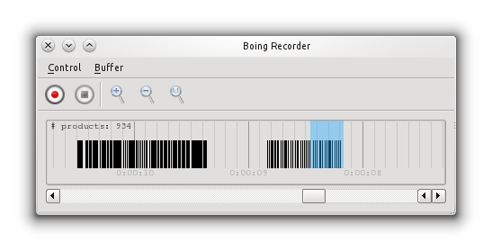

================
 Funtionalities
================

.. todo::
   Speak about the default nodes and the node uris convention.
   Also add a link to the :doc:`uris`.

Data redirection (TODO)
=======================

Files and sockets (TODO)
------------------------

Encodings (TODO)
----------------

Data dumping and statistics (TODO)
==================================

Logging and Replaying (TODO)
============================

.. todo::
   Describe data logging and replaying (both OSC and JSON formats).

The Recorder (TODO)
-------------------

.. todo::
   Describe the recorder tool.

   Figure 1: Gesture recorder.

The Player (TODO)
-----------------

.. todo::
   Describe the Player tool.

.. figure:: images/player.png
   :alt: Gesture playlist player.
   :align: center

   Figure 2: Gesture playlist player.

Data processing (TODO)
======================

Calibration (TODO)
------------------

.. todo::
   Describe the calibration node.

Filtering (TODO)
----------------

.. todo::
   Describe the filtering module.

.. seealso:: module :mod:`boing.filtering`
