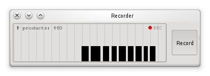
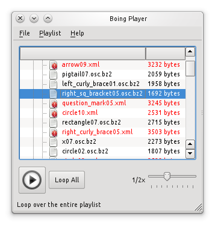

================
 Funtionalities
================

Intro.

Data redirection
================

Files and sockets
-----------------

Encodings
---------

Data dumping and statistics
===========================

Logging and Replaying
=====================

Logging using OSC/JSON.

The Recorder
------------

   Figure 1: Gesture recorder.

The Player
----------

   Figure 2: Gesture playlist player.

Data processing
===============

Calibration
-----------

Filtering
---------

