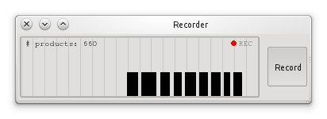
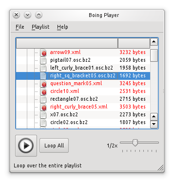

================
 Funtionalities
================

.. todo::
   Speak about the default nodes and the node uris convention.
   Also add a link to the :doc:`uris`.

Data redirection
================

Files and sockets
-----------------

Encodings
---------

Data dumping and statistics
===========================

Logging and Replaying
=====================

.. todo::
   Describe data logging and replaying (both OSC and JSON formats).

The Recorder
------------

.. todo::
   Describe the recorder tool.

   Figure 1: Gesture recorder.

The Player
----------

.. todo::
   Describe the Player tool.

   Figure 2: Gesture playlist player.

Data processing
===============

Calibration
-----------

.. todo::
   Describe the calibration node.

Filtering
---------

.. todo::
   Describe the filtering module.

.. seealso:: module :mod:`boing.filtering`
